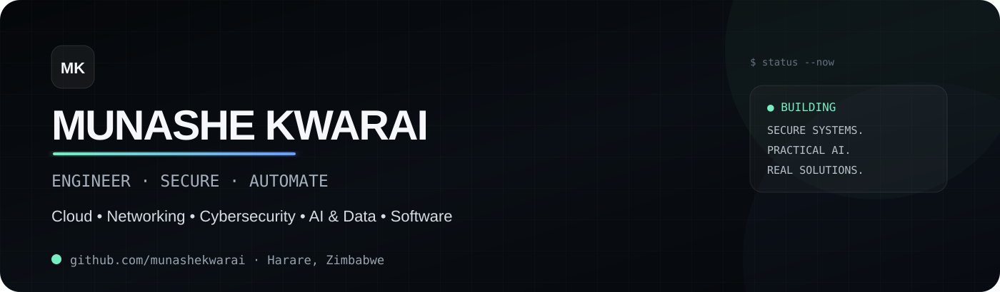
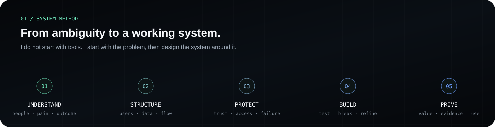
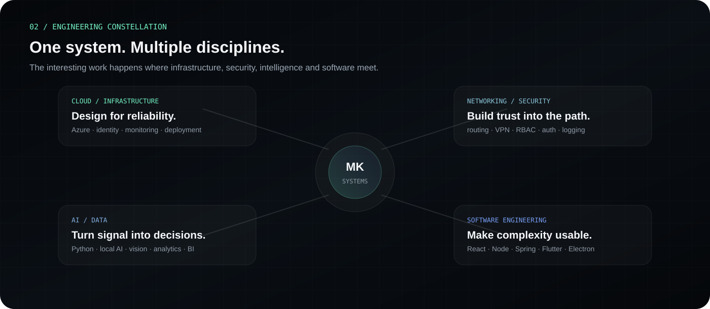
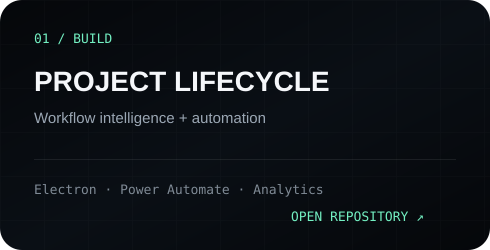
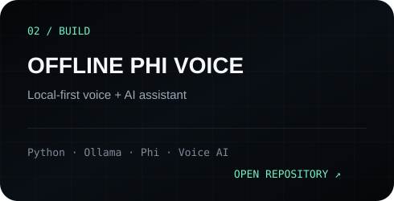
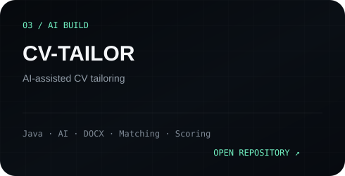
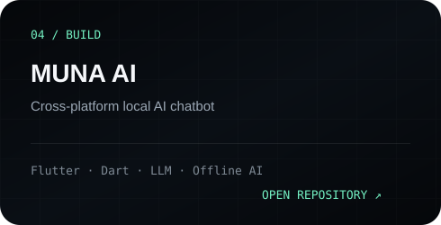
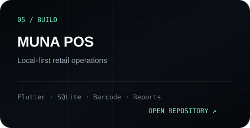
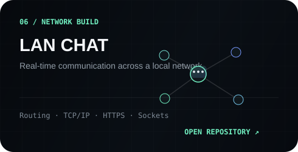
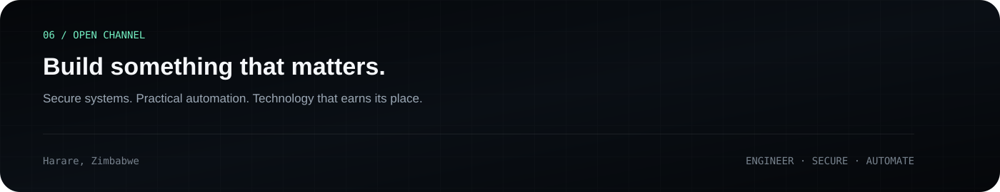

<div align="center">



<br>

<a href="https://munashekwarai.co.zw"><b>PORTFOLIO</b></a>
  ·  
<a href="mailto:[contact@munashekwarai.co.zw](mailto:contact@munashekwarai.co.zw)"><b>CONTACT</b></a>
  ·  
<a href="https://github.com/munashekwarai?tab=repositories"><b>ALL BUILDS</b></a>

</div>

<br>

<table>
<tr>
<td width="64%" valign="top">

### `> whoami`

**Munashe Kwarai** is a Zimbabwe-based technology builder working across cloud infrastructure, networking, cybersecurity, artificial intelligence, data and software engineering.

His work focuses on problems that are larger than a single framework or technology.

Problems where **users, data, networks, access, automation and interfaces** must operate as one connected system.

He approaches technology with a solutions-architect mindset: understand the real problem, structure the moving parts, protect the weak points, build deliberately and prove the result through something that actually works.

</td>

<td width="36%" valign="top">

```yaml
location: Harare, Zimbabwe

mindset:
  - systems first
  - security early
  - practical by design
  - prove with working code

status: building
```

</td>
</tr>
</table>

<br>



<br><br>



<br><br>

## `03 / SELECTED BUILDS`

A focused selection of projects that represents Munashe's engineering approach — practical systems, intelligent workflows and technology designed around real use cases.

<table>

<tr>

<td width="50%">

<a href="https://github.com/munashekwarai/project-lifecycle">

</a>

</td>

<td width="50%">

<a href="https://github.com/munashekwarai/Offline-Phi-Voice-Assistant">

</a>

</td>

</tr>

<tr>

<td width="50%">

<a href="https://github.com/munashekwarai/CV-Tailor">

</a>

</td>

<td width="50%">

<a href="https://github.com/munashekwarai/MunaAI">

</a>

</td>

</tr>

<tr>

<td width="50%">

<a href="https://github.com/munashekwarai/munapos">

</a>

</td>

<td width="50%">

<a href="https://github.com/munashekwarai/lan">

</a>

</td>

</tr>

</table>

<div align="right">

<a href="https://munashekwarai.co.zw/#projects"><b>VIEW FULL PROJECT LIBRARY ↗</b></a>

</div>

<br>

## `04 / ENGINEERING STACK`

Technology is treated as a toolbox rather than an identity. The stack changes according to the system being designed and the problem being solved.

<table>

<tr>

<td width="24%" valign="top">

### `INTERFACES`

`React`
`Next.js`
`Vue.js`
`TypeScript`
`Flutter`
`Electron`

</td>

<td width="24%" valign="top">

### `SYSTEMS`

`Node.js`
`Java`
`Spring Boot`
`Python`
`Go`
`Rust`
`PHP`

</td>

<td width="24%" valign="top">

### `DATA / AI`

`SQL Server`
`MySQL`
`SQLite`
`Prisma`
`Power BI`
`OpenCV`
`Ollama`

</td>

<td width="28%" valign="top">

### `INFRA / SECURITY`

`Azure`
`TCP/IP`
`Routing`
`Switching`
`VPN`
`JWT`
`RBAC`
`Identity`

</td>

</tr>

</table>

<br>

## `05 / CREDENTIAL SIGNAL`

Formal learning supports the practical work across networking, cloud infrastructure, security and artificial intelligence.

<table>

<tr>
<td width="24%"><b>CISCO</b></td>
<td>CCNA: Introduction to Networks · Switching, Routing and Wireless</td>
</tr>

<tr>
<td><b>MICROSOFT</b></td>
<td>Azure Fundamentals · Applied Skills across storage, networking and identity</td>
</tr>

<tr>
<td><b>ORACLE</b></td>
<td>Oracle AI Foundations Associate</td>
</tr>

<tr>
<td><b>AWS</b></td>
<td>Generative AI · Machine Learning Foundations</td>
</tr>

</table>

<div align="right">

<a href="https://munashekwarai.co.zw/#certifications"><b>VIEW CREDENTIALS ↗</b></a>

</div>

<br><br>

<table>

<tr>

<td width="55%" valign="top">

### `NOW / CURRENT DIRECTION`

```text
secure cloud architecture
networking + infrastructure
cybersecurity engineering
practical AI systems
data engineering
cross-platform software
```

</td>

<td width="45%" valign="top">

### `ENGINEERING PRINCIPLE`

> **A strong system should be easy to explain, difficult to misuse and useful enough to prove its own value.**

Munashe's work is driven by the belief that technology should not simply look impressive.

It should **solve something**.

</td>

</tr>

</table>

<br>

<a href="https://munashekwarai.co.zw">

</a>

<div align="center">

<br>

### `BUILDING SOMETHING THAT MATTERS.`

Secure systems. Practical automation. Technology designed around real problems.

<br>

<a href="https://munashekwarai.co.zw"><b>munashekwarai.co.zw</b></a>

<br><br>

`ENGINEER · SECURE · AUTOMATE`

</div>
